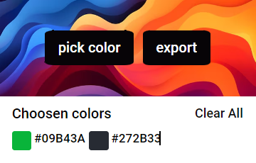
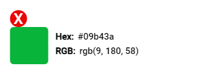
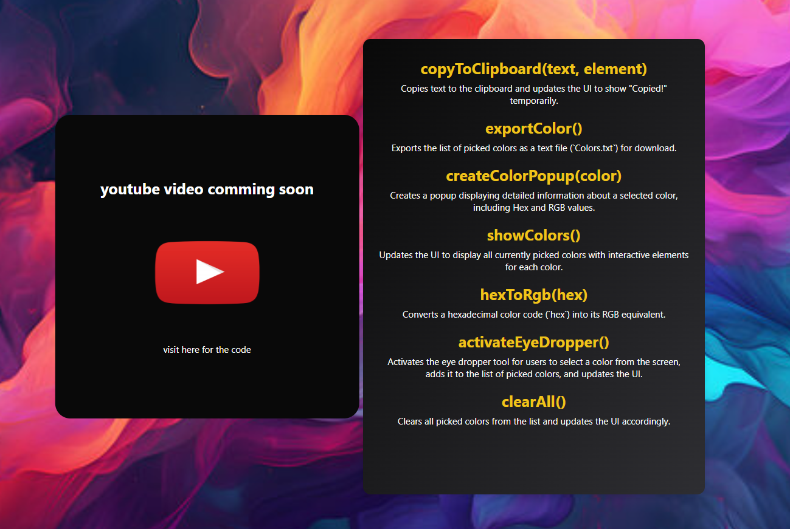

# Color Mania Chrome Extension

Color Mania is a Chrome Extension that allows users to pick colors from web pages easily.

## Installation

### Unpacking the Extension

1. **Download the extension package:**
   - Download the latest release (`color-mania.zip`) from [GitHub Releases](https://github.com/mrpeace07/color-mania/releases).
   - Unzip the downloaded file to a directory of your choice.

### Loading the Unpacked Extension in Chrome

1. **Open Google Chrome:**
   - Type `chrome://extensions/` in the address bar and press Enter to open the Extensions page.

2. **Enable Developer Mode (if not enabled):**
   - Toggle the switch in the top right corner of the Extensions page to enable Developer Mode.

3. **Load the Unpacked Extension:**
   - Click on the "Load unpacked" button.
   - Navigate to the directory where you unzipped the extension (`color-mania` directory).
   - Select the folder and click "Select Folder" or "Open".

4. **Verify Installation:**
   - The extension should now appear in the list of installed extensions on the Extensions page.
   - You can now use and interact with the extension as usual.

## Demos

### Demo 1: Picking Colors

### Demo 2: Saving Colors

### Demo 3: Option menue

## Features

- **Color Picker**: Click anywhere on a webpage to pick the color.
- **Color History**: Keep track of recently picked colors.
- **Palette Export**: Export color palettes for use in other applications.
- **Options**: Learn what are all the things that I used to build these.

## Contributing

Contributions are welcome! Please fork the repository and submit a pull request with your improvements.

